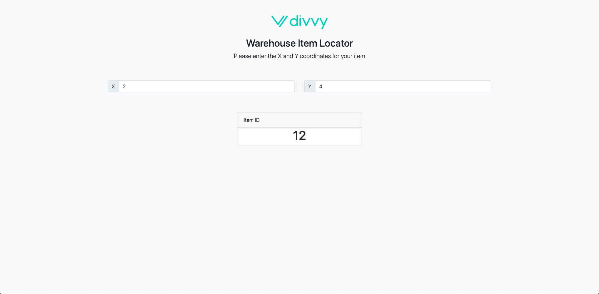

# Divvy Angular Challenge




## Getting Started

These instructions will get you a copy of the project up and running on your local machine for development and testing purposes.

### Installing

Clone the repository

```
git clone [repositoryURL]
```

Install all dependencies

```
npm install
```

From project root, start the server

```
node server/server.js
```

Navigate to 

```
http://localhost:3100/
```


## Built With

* Angular 7
* Express JS

## TODO

* Build out tests
* Remove unnecessary boilerplate code
